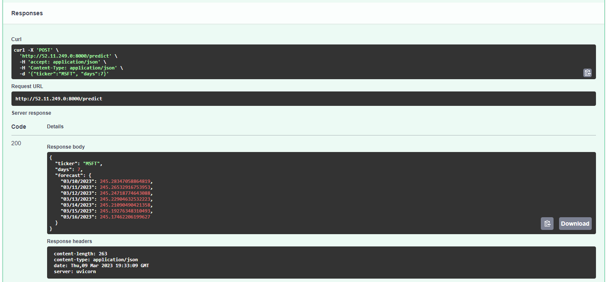

# stock-predictor
Stock Prophet

### cmd:
```bash
curl --header "Content-Type: application/json" --request POST --data '{"ticker":"MSFT", "days":7}' http://52.11.249.0:8000/predict
```
### output:
```
{"ticker":"MSFT","days":7,"forecast":{"03/10/2023":245.28347058864819,"03/11/2023":245.26532916753953,"03/12/2023":245.24718774643088,"03/13/2023":245.22904632532223,"03/14/2023":245.21090490421358,"03/15/2023":245.19276348310493,"03/16/2023":245.17462206199627}}
```



## Week 12 - MLOps 1

<h3>
How does the Prophet Algorithm differ from an LSTM?
Why does an LSTM have poor performance against ARIMA and Profit for Time Series?
</h3>

Prophet is a procedure for forecasting time series data based on an additive model where non-linear trends are fit with yearly, weekly, and daily seasonality, plus holiday effects. It works best with time series that have strong seasonal effects and several seasons of historical data. Prophet is robust to missing data and shifts in the trend, and typically handles outliers well.

A few reasons an LSTM may have poor performance compared to ARIMA and Profit for time series are Lack of sufficient training data, Poor hyperparameter tuning, Overfitting, Stationarity and Complexity.

<h3>
What is exponential smoothing and why is it used in Time Series Forecasting?
</h3>

Exponential smoothing is a method for smoothing time series data using the exponential function. It is a type of moving average (MA) smoothing where weights decrease exponentially as observations come from further in the past, the smallest weights are associated with the oldest observations.

<h3>
What is stationarity? What is seasonality? Why Is Stationarity Important in Time Series Forecasting?
</h3>

Stationarity is a property of a stochastic process that is independent of time. A stationary process has a constant mean and variance, and is autocorrelated only at zero lag. Seasonality is the presence of variations that occur at specific regular intervals less than a year, such as weekly, monthly, or quarterly.

<h3>
How is seasonality different from cyclicality? Fill in the blanks:
</h3>

Seasonality is predictable, whereas cyclicality is not.
Seasonality refers to a repeating pattern within a period of one year or less, while cyclicality refers to a repeating pattern over a period longer than one year. The two patterns are different in terms of their duration, underlying causes, and the way they affect time series data.
Another key difference between seasonality and cyclicality is that seasonality is often driven by external factors such as the weather, while cyclicality is driven by internal factors such as changes in consumer and investor behavior.
